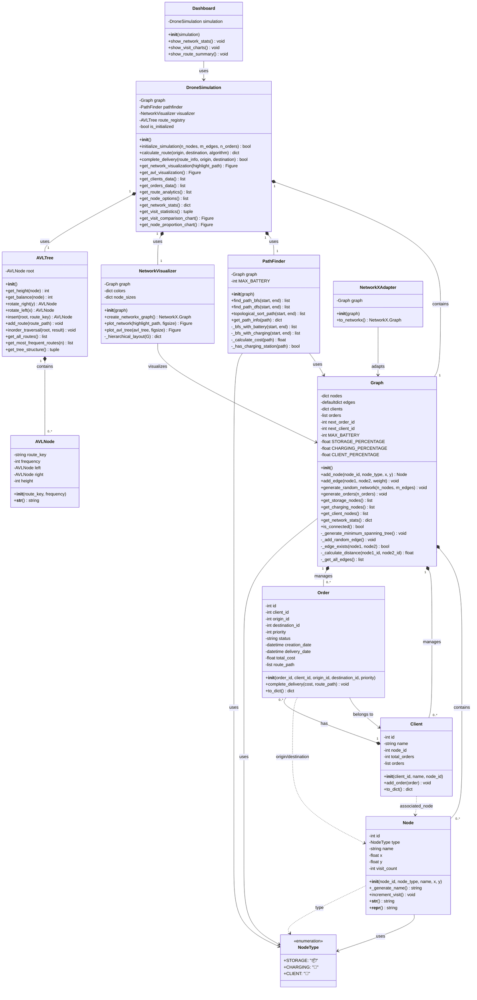

```mermaid
classDiagram
    %% ===== ENUMERACIONES =====
    class NodeType {
        <<enumeration>>
        +STORAGE: "📦"
        +CHARGING: "🔋" 
        +CLIENT: "👤"
    }

    %% ===== MODELOS PRINCIPALES =====
    class Node {
        -int id
        -NodeType type
        -string name
        -float x
        -float y
        -int visit_count
        +__init__(node_id, node_type, name, x, y)
        +_generate_name() string
        +increment_visit() void
        +__str__() string
        +__repr__() string
    }

    class Order {
        -int id
        -int client_id
        -int origin_id
        -int destination_id
        -int priority
        -string status
        -datetime creation_date
        -datetime delivery_date
        -float total_cost
        -list route_path
        +__init__(order_id, client_id, origin_id, destination_id, priority)
        +complete_delivery(cost, route_path) void
        +to_dict() dict
    }

    class Client {
        -int id
        -string name
        -int node_id
        -int total_orders
        -list orders
        +__init__(client_id, name, node_id)
        +add_order(order) void
        +to_dict() dict
    }

    class Graph {
        -dict nodes
        -defaultdict edges
        -dict clients
        -list orders
        -int next_order_id
        -int next_client_id
        -int MAX_BATTERY
        -float STORAGE_PERCENTAGE
        -float CHARGING_PERCENTAGE
        -float CLIENT_PERCENTAGE
        +__init__()
        +add_node(node_id, node_type, x, y) Node
        +add_edge(node1, node2, weight) void
        +generate_random_network(n_nodes, m_edges) void
        +generate_orders(n_orders) void
        +get_storage_nodes() list
        +get_charging_nodes() list
        +get_client_nodes() list
        +get_network_stats() dict
        +is_connected() bool
        -_generate_minimum_spanning_tree() void
        -_add_random_edge() void
        -_edge_exists(node1, node2) bool
        -_calculate_distance(node1_id, node2_id) float
        -_get_all_edges() list
    }

    %% ===== ALGORITMOS =====
    class PathFinder {
        -Graph graph
        -int MAX_BATTERY
        +__init__(graph)
        +find_path_bfs(start, end) list
        +find_path_dfs(start, end) list
        +topological_sort_path(start, end) list
        +get_path_info(path) dict
        -_bfs_with_battery(start, end) list
        -_bfs_with_charging(start, end) list
        -_calculate_cost(path) float
        -_has_charging_station(path) bool
    }

    %% ===== ESTRUCTURAS DE DATOS =====
    class AVLNode {
        -string route_key
        -int frequency
        -AVLNode left
        -AVLNode right
        -int height
        +__init__(route_key, frequency)
        +__str__() string
    }

    class AVLTree {
        -AVLNode root
        +__init__()
        +get_height(node) int
        +get_balance(node) int
        +rotate_right(y) AVLNode
        +rotate_left(x) AVLNode
        +insert(root, route_key) AVLNode
        +add_route(route_path) void
        +inorder_traversal(root, result) void
        +get_all_routes() list
        +get_most_frequent_routes(n) list
        +get_tree_structure() tuple
    }

    %% ===== UTILIDADES =====
    class NetworkVisualizer {
        -Graph graph
        -dict colors
        -dict node_sizes
        +__init__(graph)
        +create_networkx_graph() NetworkX.Graph
        +plot_network(highlight_path, figsize) Figure
        +plot_avl_tree(avl_tree, figsize) Figure
        -_hierarchical_layout(G) dict
    }

    class DroneSimulation {
        -Graph graph
        -PathFinder pathfinder
        -NetworkVisualizer visualizer
        -AVLTree route_registry
        -bool is_initialized
        +__init__()
        +initialize_simulation(n_nodes, m_edges, n_orders) bool
        +calculate_route(origin, destination, algorithm) dict
        +complete_delivery(route_info, origin, destination) bool
        +get_network_visualization(highlight_path) Figure
        +get_avl_visualization() Figure
        +get_clients_data() list
        +get_orders_data() list
        +get_route_analytics() list
        +get_node_options() list
        +get_network_stats() dict
        +get_visit_statistics() tuple
        +get_visit_comparison_chart() Figure
        +get_node_proportion_chart() Figure
    }

    %% ===== VISUAL =====
    class NetworkXAdapter {
        -Graph graph
        +__init__(graph)
        +to_networkx() NetworkX.Graph
    }

    class Dashboard {
        -DroneSimulation simulation
        +__init__(simulation)
        +show_network_stats() void
        +show_visit_charts() void
        +show_route_summary() void
    }

    %% ===== RELACIONES =====
    
    %% Node usa NodeType
    Node --> NodeType : uses

    %% Graph contiene y maneja múltiples entidades
    Graph "1" *-- "0..*" Node : contains
    Graph "1" *-- "0..*" Client : manages
    Graph "1" *-- "0..*" Order : manages
    Graph --> NodeType : uses

    %% Order se relaciona con Client
    Order --> Client : belongs to
    Client "1" *-- "0..*" Order : has

    %% PathFinder usa Graph
    PathFinder --> Graph : uses
    PathFinder --> NodeType : uses

    %% AVLTree contiene AVLNode
    AVLTree "1" *-- "0..*" AVLNode : contains

    %% DroneSimulation es el controlador principal
    DroneSimulation "1" *-- "1" Graph : contains
    DroneSimulation "1" *-- "1" PathFinder : uses
    DroneSimulation "1" *-- "1" NetworkVisualizer : uses
    DroneSimulation "1" *-- "1" AVLTree : uses

    %% NetworkVisualizer usa Graph
    NetworkVisualizer --> Graph : visualizes

    %% NetworkXAdapter adapta Graph
    NetworkXAdapter --> Graph : adapts

    %% Dashboard usa DroneSimulation
    Dashboard --> DroneSimulation : uses

    %% Relaciones de agregación y composición adicionales
    Node ..> NodeType : type
    Order ..> Node : origin/destination
    Client ..> Node : associated_node
```